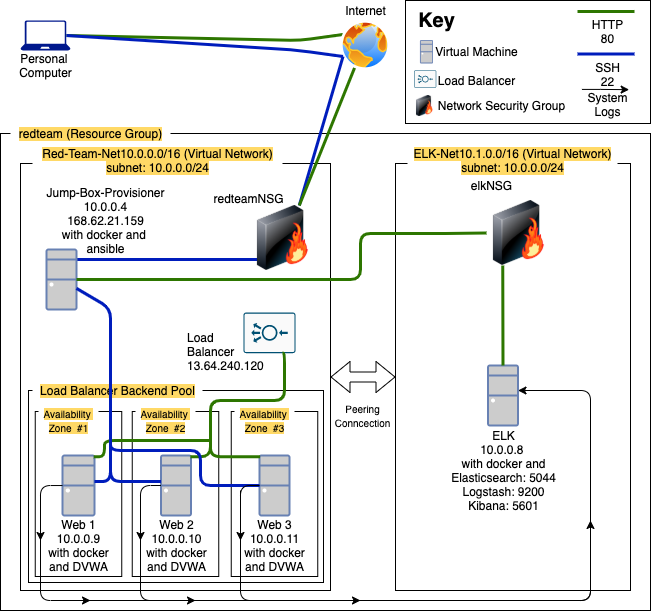

# Automated ELK Stack Deployment
The main purpose of this project is to demonstrate automated deployment of an ELK stack.

This document contains the following details:
- Description of the Topology
- Access Policies
- ELK Configuration
  - Beats in Use
  - Machines Being Monitored
- How to Use the Ansible Build

### Description of the Topology
This repository contains explanations and key files deliniating the topology and infrastructure below. 



This project exposes a load balanced instance of DVWA (D*mn Vulnerable Web Application) and monitors it with a seperate server running the ELK stack (Elasticsearch, Logstash, & Kibana). Using a load balancer allows the vulnerable web servers to maintain a high level of availability. This configuration also provides an easy way to route all HTTP traffic in a secure manner. Through the ELK server we can monitor **system metrics** and changes to the **file systems** of the web servers.

The configuration details of each machine may be found below.

| Name     |   Function  | Publuc IP Address | Loacal IP Address |  Operating System |
|----------|-------------|-------------------|-------------------|-------------------|
| Jump Box | Gateway     | 168.62.21.159     | 10.0.0.4          |  Linux            |
| Web 1    | Web Server  | N/A               | 10.0.0.9          |  Linux            |
| Web 2    | Web Server  | N/A               | 10.0.0.10         |  Linux            |
| Web 3    | Web Server  | N/A               | 10.0.0.11         |  Linux            |
| ELK      | Monitoring  | N/A               | 10.0.0.8          |  Linux            |

Each web server has been placed into its own availability zone withing the load balancer's backend pool.

### Access Policies

It is important to note that the **only** machine exposed to the internet is the **Jump-Box-Provisioner**. It is equally as important to ensure the Jump-Box-Provisioner only accepts connections from the public IP addressses of administrators who absolutely **need** access to the network. To maintain security the VMs within the inner network will only commmunicate with one another.

Below are the access policies for the VMs on the network.

| Name     | Publicly Accessible | Allowed IP Addresses |
|----------|---------------------|----------------------|
| Jump Box | Yes                 | Admin IP             |
| ELK      | No                  | 10.0.0.1-254         |
| Web 1    | No                  | 10.0.0.1-254         |
| Web 2    | No                  | 10.0.0.1-254         |
| Web 3    | No                  | 10.0.0.1-254         |


## ELK Server Configuration

**Docker** is used to manage an ELK container on the ELK VM. This means these steps can be easily replicated through the following file: 'install_elk.yml'.

### Elk Configuration

Ansible was used in order to automate the configuration of the ELK stack, this method allows for large scale repeatablility and scalability.

The playbook implements the following tasks:
- Install docker on ELK server
- Install pip3
- Install Docker python module
- Increase Virtual Memory
- Download and Launch ELK docker web container
- Enable Docker service on boot


The playbook is duplicated below.

```yaml
---
#install_elk.yml
- name: Config elk VM with Docker
  hosts: elk
  remote_user: sysadmin
  become: true
  tasks:
    - name: Install  docker.io
      apt:
        update_cache: yes
        name: docker.io
        state: present


    - name: Install pip3
      apt:
        name: python3-pip
        state: present


    - name: Install Docker python module
      pip:
        name: docker
        state: present


    - name: Increase Virtual Memory
      sysctl:
        name: vm.max_map_count
        value: '262144'
        state: present
        reload: yes


    - name: download and launch elk docker web container
      docker_container:
        name: elk
        image: sebp/elk:761
        state: started
        restart_policy: always
        published_ports:
          - 5601:5601
          - 9200:9200
          - 5044:5044


    - name: Enable service docker on boot
      systemd:
        name: docker
        enabled: yes

```

### Target Machines & Beats
This ELK server is configured to monitor the Web 1, WEb 2, and Web 3 VMs, at `10.0.0.9`, `10.0.0.10`, and `10.0.0.11` respectively.

We have installed the following Beats on these machines:
- Filebeat, tracking changes to the file systems of the web servers through apache logs
- Metricbeat, provides system metrics including CPU usage, SSH logins, failed `sudo` escalations, etc.
- Packetbeat, comparable to wireshark, collects packets passing through the NIC.

The followinf playbook, install_filebeat.yml installs Filebeat on the web servers. The playbook for installing Metricbeat and Packetbeat are not included. In order to create them replace every instance of the word 'filebeat' in the following playbook with the desired beat.  

```yaml
---
#install_filebeat.yml
- name: installing and launching filebeat
  hosts: webservers
  become: yes
  tasks:


  - name: download filebeat deb
    command: curl -L -O https://artifacts.elastic.co/downloads/beats/filebeat/filebeat-7.4.0-amd64.deb

  - name: install filebeat deb
    command: dpkg -i filebeat-7.4.0-amd64.deb


  - name: drop in filebeat.yml
    copy:
      src: /etc/ansible/filebeat-config.yml
      dest: /etc/filebeat/filebeat.yml


  - name: enable and configure system module
    command: filebeat modules enable system


  - name: setup filebeat
    command: filebeat setup


  - name: start filebeat service
    command: service filebeat start


  - name: enable service filebeat on boot
    systemd:
      name: filebeat
      enabled: yes

```

### Using the Playbooks
Prior to being able to use the yml files, an ansible control node is necessary. This project uses the Jump-Box-Provisioner for this purpose, as it should be the VM which is public facing.

To use the playbooks, we must perform the following steps:
- SSH into the Ansible Control Node
- Copy the playbooks to the Ansible Control Node at /etc/ansible*
- Update /etc/ansible/hosts file to look like the following\
```
[webservers]
10.0.0.9
10.0.0.10
10.0.0.11

[elk]
10.0.0.8
```
- Run each playbook on the appropriate targets

*The easiest way to copy the playbooks is to use Git:

```bash
$ cd /etc/ansible
$ mkdir files
# Clone Repository + IaC Files
$ git clone https://github.com/benpariswork/Automated-ELK-Deployment
# Move Playbooks and hosts file Into `/etc/ansible`
$ cp project-1/playbooks/* .
$ cp project-1/files/* ./files
```

This copies the playbook files to the correct place.

After this, the commands below run the playbook:

 ```bash
 $ cd /etc/ansible
 $ ansible-playbook install_elk.yml elk
 $ ansible-playbook install_filebeat.yml webservers
 ```

To verify success, wait five minutes to give ELK time to start up. 

Then, run: `curl http://10.0.0.8:5601`. This is the address of Kibana. If the installation succeeded, this command should print HTML to the console.


